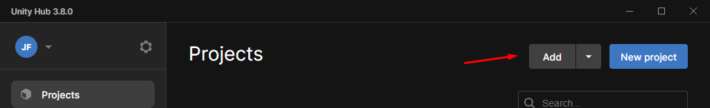
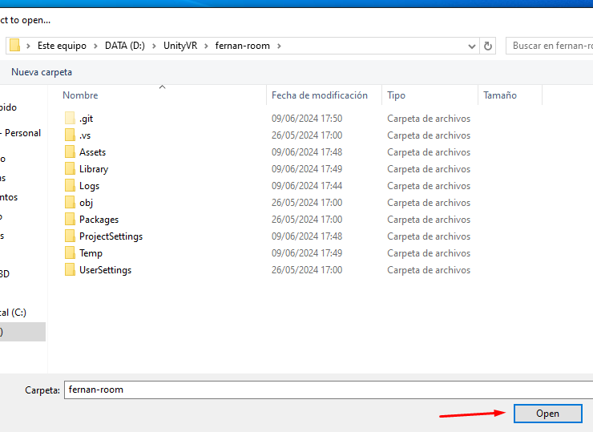
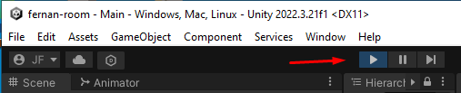
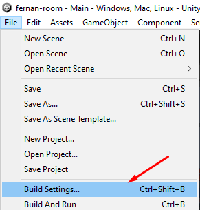

# FERNANROOM

## Instalaciones

Se necesitan tener instalado:
-   [Unity 2022.3.21f1](https://unity.com/es/releases/editor/archive)  
-   [UnityHub](https://unity.com/es/unity-hub)

## Implementación

Decargarmos o clonamos el proyecto:

  

Añadimos el proyecto descomprimido en UnityHub:

  

## Ejecutar el proyecto

### Desde Unity: 
Pulsamos el botón de Play:

  

### Exportarlo:
Vamos Build Settings

  

  

